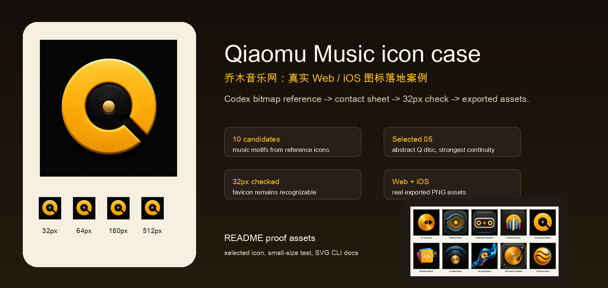
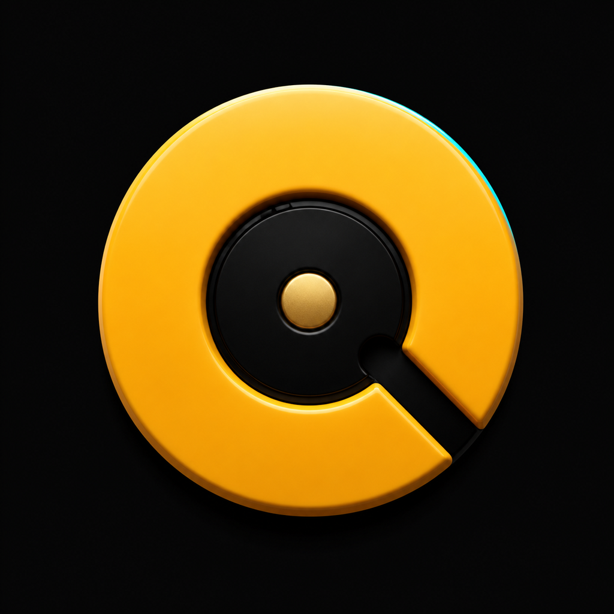
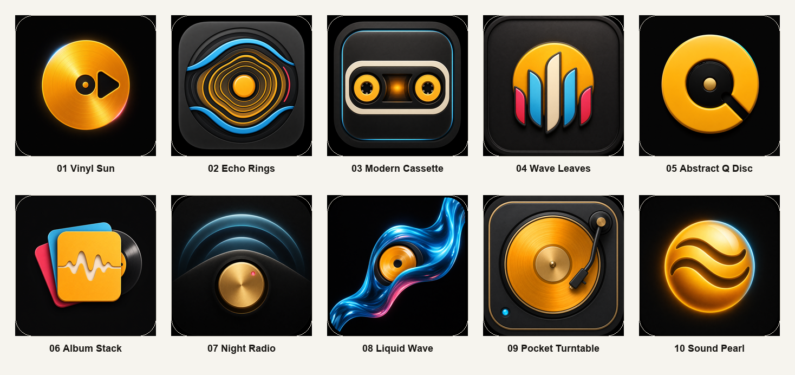
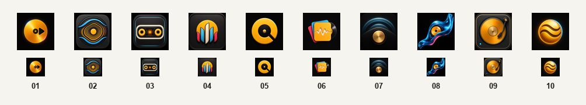
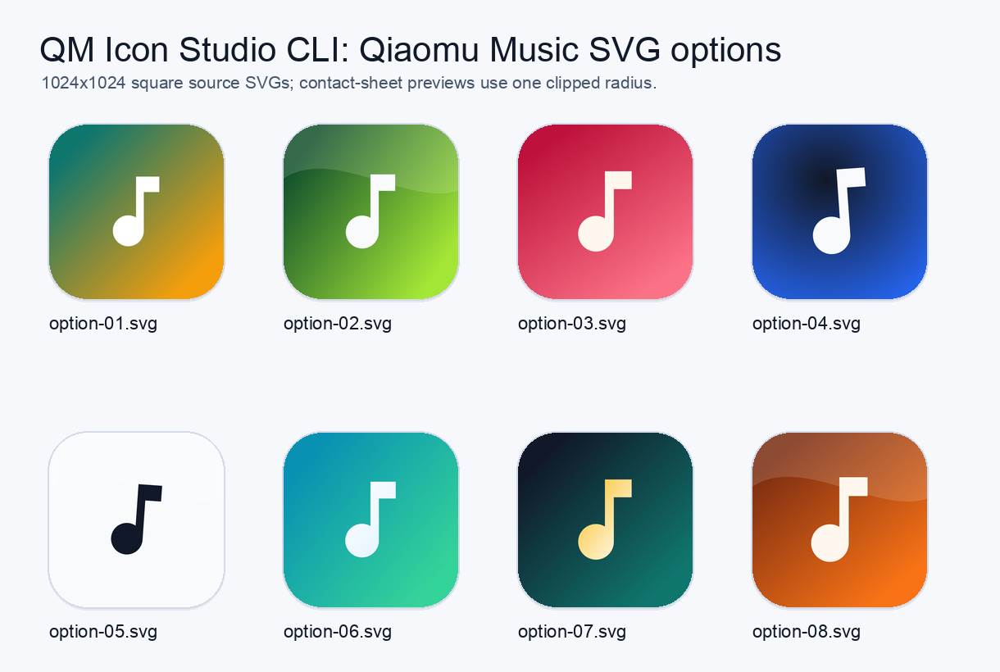

# qiaomu-icon-generator

> 设计网站 favicon、iOS App 图标或工具品牌入口时，最难的常常不是“生成一张图”，而是一次拿到可比较的方向、让用户选中、再导出到 Web 和 iOS 真实可用的尺寸。
> Generate comparable app-icon directions, let the user choose, then export real Web and iOS icon assets.

<p align="center">
  
</p>

<p align="center">
  <a href="https://github.com/joeseesun/qiaomu-icon-generator/stargazers"></a>
  <a href="https://github.com/joeseesun/qiaomu-icon-generator/network/members"></a>
  <a href="https://github.com/joeseesun/qiaomu-icon-generator/issues"></a>
  <a href="https://github.com/joeseesun/qiaomu-icon-generator/commits/main"></a>
  <a href="LICENSE"></a>
</p>

**中文** | [English](#english)

```bash
npx skills add joeseesun/qiaomu-icon-generator
```

**已验证:** `npx skills add joeseesun/qiaomu-icon-generator --list` 可发现，真实临时目录安装可落盘 `SKILL.md`。

## 真实示例输出

主示例换成了真实产品「乔木音乐网」：用 Codex bitmap reference method 生成 10 个候选，做 contact sheet 和 64 / 32px 可读性检查，最后选中 `option-05`，并实际导出到网站 favicon 和 iOS `AppIcon.appiconset`。

| 最终图标 | 候选测试 | 小尺寸测试 |
|---|---|---|
|  |  |  |

选择理由：`option-05` 是「Abstract Q Disc」，保留乔木音乐原有黑金气质，同时把唱片、播放入口和抽象 Q 结合起来；32px favicon 下仍能辨认。完整记录见 [`choices.md`](docs/assets/examples/qiaomu-music/codex-bitmap/choices.md)。

## 为什么值得用

很多图标工作会卡在三个地方：

- 只生成一张图，没有比较，用户很难选。
- 大图好看，但 32px favicon 看不清。
- 用户选中了方向，却没有导出 `favicon`、`apple-touch-icon`、`AppIcon.appiconset` 的完整尺寸。

`qiaomu-icon-generator` 把这件事变成一个可复用流程：先读项目上下文，再生成 6-12 个候选，做 contact sheet 和小尺寸预览，最后把选中的图标导出成 Web / iOS 可用资产。

## 两种生成方法

| 方法 | 适合场景 | 示例输出 |
|---|---|---|
| Codex bitmap reference method | 需要更像 iOS App Store 的精致 raster 图标，或要参考本地 icon gallery |  |
| QM Icon Studio CLI | 需要稳定、干净、矢量友好的 SVG 候选，或者想先快速拿一批可编辑方向 |  |

默认先根据用户要求选择方法。用户明确说“Codex 内置生图”“参考这些 icon 风格”时，走 Codex bitmap reference method。

### SVG / CLI 快速样例

```bash
node "$HOME/Documents/qm-icon-studio/cli/qm-icon-options.mjs" \
  --name "Qiaomu Music" \
  --query music \
  --count 8 \
  --out design/qiaomu-music-svg-cli-options \
  --offline
```

这条路径会输出可编辑 SVG：`option-01.svg` 到 `option-08.svg`、`contact-sheet.svg`、`choices.md` 和 `qm-icon-options.json`。`option-*.svg` 是严格 1024x1024 方形源图；`contact-sheet.svg` 只在预览层使用统一圆角裁剪，避免出现既不像正方形、也不像合理圆角的半截角线。如果本机装了 Playwright，可加 `--png` 让 CLI 直接渲染 PNG；否则保留 SVG 也能继续评审和导出。示例见 [`docs/assets/examples/qiaomu-music/svg-cli/`](docs/assets/examples/qiaomu-music/svg-cli/)。

## 安装

```bash
npx skills add joeseesun/qiaomu-icon-generator
```

安装后可以确认：

```bash
test -f ~/.agents/skills/qiaomu-icon-generator/SKILL.md
```

## 前置要求

- [ ] 已安装 Node.js 和 `npx`，用于安装 skill。
- [ ] 若使用 Codex 内置生图，需要在支持 `image_gen` 的 Codex 环境中运行。
- [ ] 若要导出 Web/iOS PNG 尺寸，需要 Python 3 和 Pillow：`python3 -m pip install pillow`。
- [ ] 若使用 QM Icon Studio CLI，需要本机有对应 CLI。Joe 本机默认路径是 `$HOME/Documents/qm-icon-studio/cli/qm-icon-options.mjs`。
- [ ] 若要参考 Icon Museum，需要本地参考库或用户提供的图标目录；参考图只用于风格启发，不能复制商标和独特构图。

## 你可以这样说

- “给这个新网站设计 10 个 favicon / iOS app icon 候选。”
- “参考我下载的 Icon Museum 图标风格，生成一组让我选。”
- “选 05，把它导出成 Web favicon 和 iOS AppIcon。”
- “这个项目已有图标，别覆盖生产文件，先放到 `design/icon-options/` 让我选。”
- “用 Codex 内置生图，不要用 SVG CLI。”

## 典型工作流

1. 读取项目名、用途、主色、现有 favicon、目标平台。
2. 选择生成方法：CLI 或 Codex bitmap reference method。
3. 生成 6-12 个候选，默认放在 `design/<product-slug>-icon-options/`。
4. 生成 `contact-sheet.png`，再生成 `favicon-readability-sheet.png` 检查 64px / 32px。
5. 用户选中一个编号。
6. 运行导出脚本输出 Web / iOS 尺寸。
7. 只在用户确认后替换生产图标。

## 导出脚本

选中候选后，把它导出为网站和 iOS 尺寸：

```bash
python3 scripts/export_selected_icon.py \
  --source design/qiaomu-music-icon-options/ios-1024/option-05.png \
  --web-out public/icons \
  --web-prefix qiaomu-music-icon \
  --appiconset ios/QiaomuMusic/QiaomuMusic/Assets.xcassets/AppIcon.appiconset
```

Web 常用输出：

- `qiaomu-music-icon-32.png`
- `qiaomu-music-icon-64.png`
- `qiaomu-music-icon-180.png`
- `qiaomu-music-icon-192.png`
- `qiaomu-music-icon-512.png`
- `qiaomu-music-icon-1024.png`

iOS 输出会按 `.appiconset/Contents.json` 中已有条目生成对应像素尺寸。

## 质量门槛

- 不要在用户选择前覆盖现有生产图标。
- 候选图标必须能在 32px 下辨认。
- 最终 Web/iOS PNG 必须是方形、无透明通道。
- iOS master 使用 1024x1024 PNG。
- SVG CLI 源文件必须保持正方形；如果展示圆角预览，必须用统一 mask 裁剪，不能只露出四角描边。
- Codex 生图必须避免文字、字母、数字、伪文字、水印、真实商标。
- 参考图只用于风格，不复制原图、应用名、商标或独特构图。

## 示例：乔木音乐

一次真实使用中，这个 skill 为乔木音乐网生成了 10 个 Codex bitmap 候选，并用同一主题跑了 8 个 SVG CLI 候选作为对照。

- Codex bitmap 候选：`docs/assets/examples/qiaomu-music/codex-bitmap/contact-sheet.png`
- SVG CLI 候选：`docs/assets/examples/qiaomu-music/svg-cli/contact-sheet.svg`
- 用户选择：`option-05`
- 视觉方向：黑底、琥珀唱片、抽象 Q / 唱臂切口
- Web 输出：`docs/assets/examples/qiaomu-music/final-web/qiaomu-music-icon-*.png`
- iOS 输出：`AppIcon.appiconset/AppIcon-*.png`
- 验证：Web build 通过，iOS simulator build 通过，32px favicon 可辨认

## Troubleshooting

| 问题 | 原因 | 解决方法 |
|---|---|---|
| `npx skills add` 找不到 skill | GitHub 还没同步或 `SKILL.md` frontmatter 无效 | 先运行 `npx skills add joeseesun/qiaomu-icon-generator --list` |
| 导出脚本报 `No module named PIL` | 没装 Pillow | 运行 `python3 -m pip install pillow` |
| 生成图里出现字母或伪文字 | Prompt 没有强约束 | 加上 `no text, no letters, no numbers, no pseudo-text` 并重新生成 |
| 32px 看不清 | 图标细节太多 | 优先选择大块面、强轮廓、少元素候选 |
| `.appiconset` 没有更新 | 路径不是现有 AppIcon 目录或缺少 `Contents.json` | 指向真实 `AppIcon.appiconset`，不要指向 `Assets.xcassets` 根目录 |

<!-- qiaomu-profile:start -->
## 关于向阳乔木

向阳乔木（乔向阳 / Joe）是一位实践型 AI 产品与内容创作者，长期把前沿 AI 变化转译成可复用的工作流、产品判断、AI 编程实践、AI 搜索实践和 GEO/AI 营销方法。

- 个人网站: https://qiaomu.ai
- 博客: https://blog.qiaomu.ai
- 乔木推荐: https://tuijian.qiaomu.ai
- X: https://x.com/vista8
- GitHub: https://github.com/joeseesun/
- 微信公众号: 向阳乔木推荐看

### 支持与关注

| 打赏支持 | 微信公众号 |
|---|---|
|  |  |
| 感谢支持乔木持续分享 AI 实践 | 扫码关注「向阳乔木推荐看」 |

<!-- qiaomu-profile:end -->

## License

MIT

Copyright (c) 向阳乔木<br>
X: https://x.com/vista8<br>
GitHub: https://github.com/joeseesun/

---

<a name="english"></a>
## English

`qiaomu-icon-generator` helps agents generate multiple app-icon, favicon, or website-icon candidates, present a contact sheet, and export the selected direction into real Web and iOS icon assets.

Install:

```bash
npx skills add joeseesun/qiaomu-icon-generator
```

It supports two paths:

- QM Icon Studio CLI for clean vector-friendly SVG/PNG candidates.
- Codex bitmap reference method for richer iOS-style raster icons using local reference galleries and built-in image generation.

Real example output from Qiaomu Music:

| Selected icon | Bitmap candidates | SVG CLI candidates |
|---|---|---|
|  |  |  |

Typical flow:

1. Inspect product context, colors, existing icons, and target platforms.
2. Generate 6-12 candidates.
3. Build a contact sheet and favicon readability preview.
4. Wait for the user to choose.
5. Export Web icons and an iOS `AppIcon.appiconset`.

The export helper uses Pillow:

```bash
python3 -m pip install pillow
```

Then:

```bash
python3 scripts/export_selected_icon.py \
  --source design/my-product-icon-options/ios-1024/option-05.png \
  --web-out public/icons \
  --web-prefix my-product-icon \
  --appiconset path/to/AppIcon.appiconset
```

Boundaries:

- Do not overwrite production icons before the user chooses.
- Do not copy trademarks, app names, or distinctive compositions from reference icons.
- Final Web/iOS icons should be square, opaque PNGs and readable at 32px.
